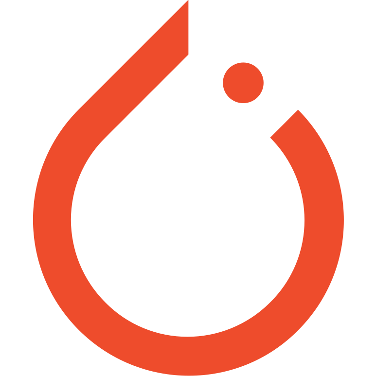
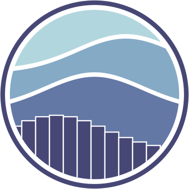
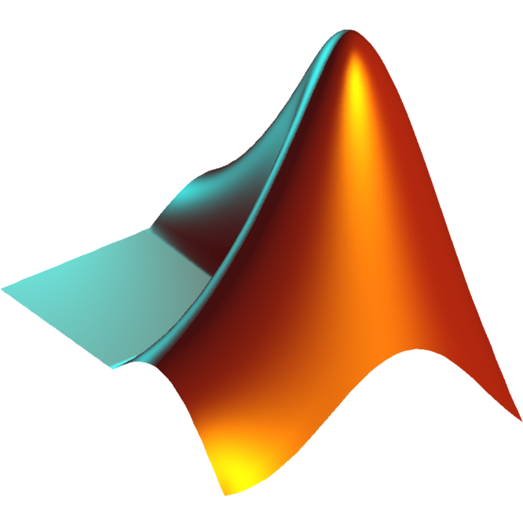

You can find an extended version of my CV [here](../static/CV_TAMINE_Mélissa.pdf).

## Education

    

        
        
IMT Atlantique

        
Master of Engineering

        
2019 - 2021

    

    

        
        
ENSAE Paris

        
Master of Engineering

        
2021 - 2023

    

---

## Professional Experience

    

        
        
Huawei Technologies

        
Machine learning Scientist intern

        
Amsterdam, Netherlands

        
April 2021 - July 2021

    

    

        
        
Nokia Bell Labs

        
Research Scientist intern

        
Nozay, France

        
May 2022 - July 2022

    

    

        
        
Criteo AI Lab

        
Research Scientist intern

        
Paris, France

        
May 2023 - September 2023

    

---

## Skills

### Machine Learning

    

        
        
PyTorch

    

    

        
        
Tensorflow

    

    

        
        
Keras

    

    

        
        
Scikit Learn

    

    

        
        
Seaborn

    

### Programming

    

        
        
Python

    

    

        
        
Java

    

    

        
        
Julia

    

    

        
        
R

    

    

        
        
Matlab

    

### Development

    

        
        
Git

    
  
    

        
        
Docker

    

---

## Projects

There is a list of my projects with a brief description about them in the [projects](/projects) page.

---